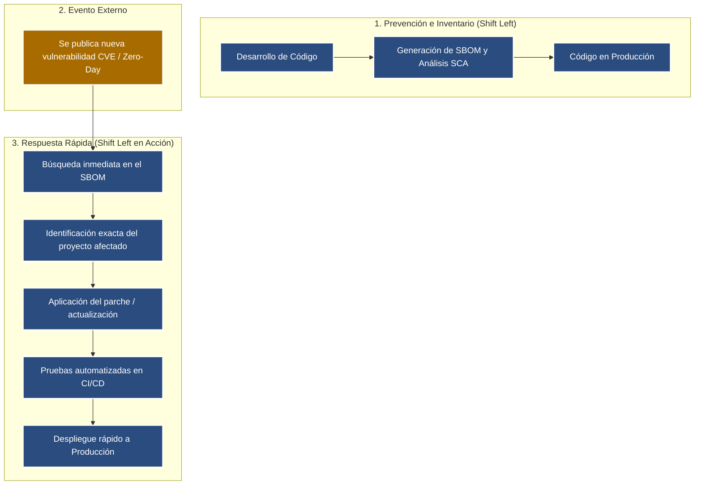

# **SC-LAB-003**

**Equipo**:
Ariadna Itzel Alvarez,
Montserrat Hernandez,
Luis Antonio Rivera,
Carlos Ivan Santana

**Fecha**:
11 de Septiembre de 2026

---

## Recuperación de contraseñas

RF-010: «SecureCampus deberá permitir al usuario recuperar su contraseña». El enlace generado dura 7 días y puede reutilizarse varias veces.

| Pregunta                                                      | Respuesta del equipo                                                                                                                                                               |
| ------------------------------------------------------------- | ---------------------------------------------------------------------------------------------------------------------------------------------------------------------------------- |
| ¿Dónde se originó principalmente la omisión?                  | En la fase de Requisitos; el requisito se redactó solo pensando en la funcionalidad, sin criterios de aceptación de seguridad (duración máxima, uso único, invalidación tras uso). |
| ¿Dónde podría descubrirse?                                    | En la etapa de Diseño o de Pruebas (casos negativos: reutilizar el enlace, usarlo tras varios días). Si no, se descubre en Operación vía incidente o pentest.                      |
| ¿Qué artefactos habría que cambiar si se descubre en pruebas? | El requisito, el diseño del flujo/token, el código de expiración/invalidación, los casos de prueba y la documentación técnica.                                                     |
| ¿Qué requisitos/criterios de seguridad faltaron?              | Tiempo de vida corto del token, invalidación tras un solo uso, invalidación de tokens previos al generar uno nuevo, token con alta entropía, registro/auditoría de solicitudes.    |
| ¿Qué moverían a la izquierda?                                 | Definir criterios de seguridad desde el requisito (más explícito sobre expiración y uso único) y hacer threat modeling en Diseño, antes de llegar a desarrollo/pruebas.            |

**Threat Modeling**: Proceso estructurado para identificar, cuantificar y priorizar las vulnerabilidades y los riesgos de seguridad en un sistema o aplicación antes de que los atacantes puedan explotarlos

## Reto integral - 3 situaciones

| Caso                  | Origen                                            | Descubrimiento                                         | Retrabajo / Impacto                                                                                                                                                          | Actividad Shift Left                                                                                                                                           | Control posterior                                                                                                                      |
| --------------------- | ------------------------------------------------- | ------------------------------------------------------ | ---------------------------------------------------------------------------------------------------------------------------------------------------------------------------- | -------------------------------------------------------------------------------------------------------------------------------------------------------------- | -------------------------------------------------------------------------------------------------------------------------------------- |
| **A · Administrador** | Requisitos / Diseño                               | Pruebas o Producción                                   | Rediseño del esquema de autorización (RBAC), reescritura de controladores de la API, modificación de vistas frontend y rehacer casos de prueba de integración.               | Definir matrices de control de acceso granulares (separación de lecturas/escrituras) desde la fase de requisitos.                                              | Monitoreo y auditoría de eventos de autorización fallidos (`403 Forbidden`) en producción mediante WAF o SIEM.                         |
| **B · Upload**        | Requisitos / Diseño                               | Pruebas (Pentest) o Producción                         | Modificar controladores de subida, agregar librerías de desinfección/validación MIME, reconfigurar el almacenamiento (S3) y migrar/desinfectar archivos subidos previamente. | Establecer políticas de carga segura (lista blanca de extensiones, límite de tamaño, almacenamiento fuera del _web root_ y renombrado aleatorio) en el diseño. | Escaneo antivirus/antimalware asíncrono en el servidor de archivos y monitoreo de ejecución no autorizada.                             |
| **C · Dependencia**   | Operación / Mantenimiento (Evolución de amenazas) | Producción (8 meses después de incorporar la librería) | Actualizar la versión de la biblioteca, validar compatibilidad con el código actual, ejecutar regresiones completas y actualizar contenedores/servidores.                    | Implementar análisis de composición de software (SCA) y gestión de dependencias (_Software Bill of Materials_ - SBOM) en el pipeline de CI/CD.                 | Alertas automatizadas de vulnerabilidades (ej. GitHub Dependabot), parches periódicos y monitoreo de vulnerabilidades conocidas (CVE). |

## Escalera de costo cualitativa

### Pregunta

**¿Puede Shift Left ayudar con una vulnerabilidad que todavía no existía públicamente cuando desarrollamos?**

El enfoque Shift Left no es una bola de cristal para predecir fallas futuras, sino una estrategia de resiliencia y velocidad de respuesta cuando una nueva vulnerabilidad (Zero-Day o un nuevo registro CVE) sale a la luz.
¿Cómo ayuda Shift Left ante lo desconocido?
Reducción de la superficie de ataque: Al aplicar modelado de amenazas, principio de menor privilegio y hardening desde el diseño, se aíslan los componentes. Si una función se vuelve vulnerable mañana, el impacto potencial en el resto del sistema es mucho menor.
Programación defensiva por defecto: Prácticas como la sanitización estricta de entradas y la gestión segura de memoria bloquean la ejecución de muchos exploits, incluso si la falla específica aún no ha sido categorizada.
Visibilidad con SBOM (Software Bill of Materials): Generar el inventario de dependencias de forma automatizada en el pipeline permite que, al publicarse un CVE, identifiques en segundos cuáles de tus aplicaciones contienen el componente afectado.
Remediación en tiempo récord: La verdadera fuerza de Shift Left en este escenario es el Time-to-Remediate (TTR). Con una suite de pruebas de seguridad y regresión ya integrada en el CI/CD, actualizar la librería afectada, validar y desplegar el parche toma horas en lugar de semanas.

## Reflexión

**1. ¿Shift Left elimina la necesidad de seguridad en operación?**

>No. Shift Left minimiza y previene las fallas conocidas en etapas tempranas, pero la seguridad es una estrategia en capas (Defense in Depth). La fase de operación sigue siendo indispensable para:
>* Detectar vectores de ataque no contemplados y vulnerabilidades Zero-Day.
>* Monitorear eventos anómalos, intentos de fuerza bruta e intrusiones en tiempo real (vía WAF, SIEM o SOC).
>* Mantener la infraestructura subyacente, sistemas operativos y runtime continuamente parcheados.

**2. ¿Por qué una funcionalidad puede cumplir su requisito funcional y seguir siendo insegura?**

>Porque la funcionalidad describe lo que el sistema debe hacer cuando los datos son válidos y la interacción es legítima, mientras que la seguridad define lo que el sistema NO debe permitir bajo entradas maliciosas, abuso de lógica o estados imprevistos.
>
>Por ejemplo: El requisito RF-010 cumplió funcionalmente al enviar el enlace y restablecer la clave; sin embargo, al no definir límites de vigencia ni de un solo uso, permitió vectores de abuso e impersonación de identidad.

**3. ¿Qué decisión de su equipo habría sido más barata de corregir antes?**

>La especificación técnica del Mecanismo de Expiración y Reutilización del Token de Recuperación (RF-010) en la fase de Requisitos/Diseño. Añadir la regla en Requisitos solo sería modificar unas líneas en el documento de especificación y desde aquí ya se tomaría en cuenta para el resto del proyecto.
