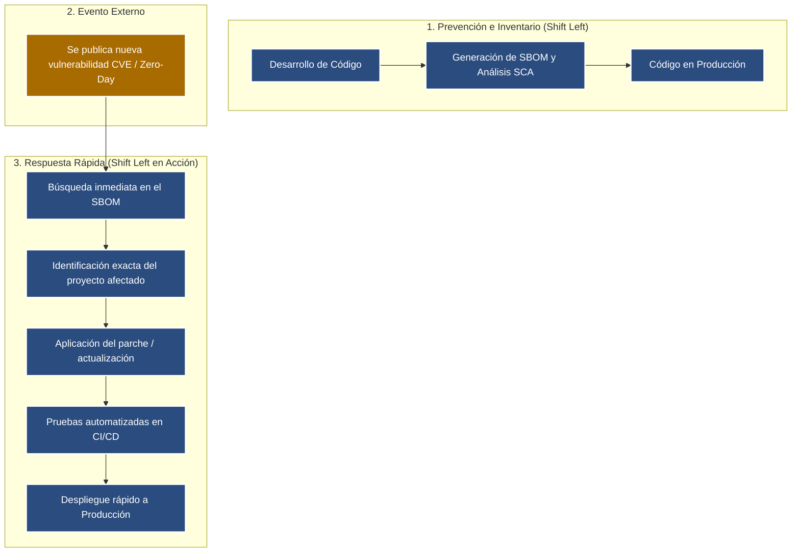

# **SC-LAB-003**

**Equipo**:
Ariadna Itzel Alvarez, 
Montserrat Hernandez, 
Luis Antonio Rivera, 
Carlos Santana

**Fecha**:
11 de Septiembre de 2026

-----
## Recuperación de contraseñas

RF-010: «SecureCampus deberá permitir al usuario recuperar su contraseña». El enlace generado dura 7 días y puede reutilizarse varias veces.

| Pregunta | Respuesta del equipo |
|---|---|
| ¿Dónde se originó principalmente la omisión? | En la fase de Requisitos; el requisito se redactó solo pensando en la funcionalidad, sin criterios de aceptación de seguridad (duración máxima, uso único, invalidación tras uso). |
| ¿Dónde podría descubrirse? | En la etapa de Diseño o de Pruebas (casos negativos: reutilizar el enlace, usarlo tras varios días). Si no, se descubre en Operación vía incidente o pentest. |
| ¿Qué artefactos habría que cambiar si se descubre en pruebas? | El requisito, el diseño del flujo/token, el código de expiración/invalidación, los casos de prueba y la documentación técnica. |
| ¿Qué requisitos/criterios de seguridad faltaron? | Tiempo de vida corto del token, invalidación tras un solo uso, invalidación de tokens previos al generar uno nuevo, token con alta entropía, registro/auditoría de solicitudes. |
| ¿Qué moverían a la izquierda? | Definir criterios de seguridad desde el requisito (más explícito sobre expiración y uso único) y hacer threat modeling en Diseño, antes de llegar a desarrollo/pruebas. |

**Threat Modeling**: Proceso estructurado para identificar, cuantificar y priorizar las vulnerabilidades y los riesgos de seguridad en un sistema o aplicación antes de que los atacantes puedan explotarlos

## Reto integral - 3 situaciones

## Escalera de costo cualitativa

## Pregunta 
**¿Puede Shift Left ayudar con una vulnerabilidad que todavía no existía públicamente cuando desarrollamos?**
El enfoque Shift Left no es una bola de cristal para predecir fallas futuras, sino una estrategia de resiliencia y velocidad de respuesta cuando una nueva vulnerabilidad (Zero-Day o un nuevo registro CVE) sale a la luz.
¿Cómo ayuda Shift Left ante lo desconocido?
Reducción de la superficie de ataque: Al aplicar modelado de amenazas, principio de menor privilegio y hardening desde el diseño, se aíslan los componentes. Si una función se vuelve vulnerable mañana, el impacto potencial en el resto del sistema es mucho menor.
Programación defensiva por defecto: Prácticas como la sanitización estricta de entradas y la gestión segura de memoria bloquean la ejecución de muchos exploits, incluso si la falla específica aún no ha sido categorizada.
Visibilidad con SBOM (Software Bill of Materials): Generar el inventario de dependencias de forma automatizada en el pipeline permite que, al publicarse un CVE, identifiques en segundos cuáles de tus aplicaciones contienen el componente afectado.
Remediación en tiempo récord: La verdadera fuerza de Shift Left en este escenario es el Time-to-Remediate (TTR). Con una suite de pruebas de seguridad y regresión ya integrada en el CI/CD, actualizar la librería afectada, validar y desplegar el parche toma horas en lugar de semanas.

## Reflexión
